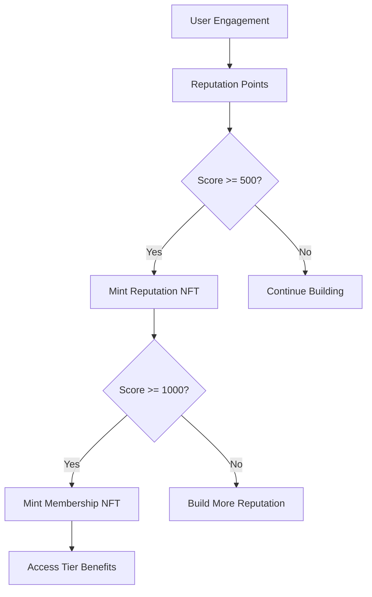

# BitTribute 🚀


[](https://www.stacks.co/)
[](https://bitcoin.org/)
[](https://clarity-lang.org/)
[](LICENSE)

> **A revolutionary Bitcoin Layer-2 protocol that transforms digital social interactions into measurable value through algorithmic reputation mining, creator monetization pathways, and NFT-based community governance on Stacks.**

## 🌟 Overview

BitTribute establishes the first truly decentralized social economy where authentic engagement generates real Bitcoin-backed rewards. Our protocol leverages Clarity smart contracts to create a trustless ecosystem where content creators, community members, and supporters can build sustainable digital economies through reputation-based value creation.

**Built on Stacks. Secured by Bitcoin. Powered by Community.**

## ✨ Key Features

### 🎯 **Dynamic Reputation System**

- **Algorithmic scoring** with time-decay mechanics
- **Anti-gaming protection** with cooldown mechanisms
- **Transparent calculation** of user contributions
- **Maximum score ceiling** at 10,000 points

### 🏆 **Multi-Tier NFT Membership**

- **Four exclusive tiers**: Silver, Gold, Platinum, Diamond
- **Progressive benefits** based on reputation milestones
- **Community governance** participation rights
- **VIP access** to premium features

### 💰 **Creator Monetization**

- **Direct STX tipping** with 1 STX minimum
- **Engagement rewards** for authentic interactions
- **Configurable earning** thresholds
- **Transparent revenue** distribution

### 🔒 **Bitcoin-Secured Governance**

- **Transparent operations** on Stacks blockchain
- **Community-driven** decision making
- **Emergency controls** for protocol safety
- **Decentralized ownership** structure

## 🏗️ Architecture

### Smart Contract Components

```clarity
// Core NFT Collections
├── bittribute-reputation     // Reputation certificates
└── bittribute-membership     // Tier-based memberships

// Data Storage Maps
├── user-profiles            // User reputation & activity
├── creator-settings         // Creator monetization config
├── engagement-history       // Interaction tracking
├── membership-tiers         // Tier definitions & benefits
├── reputation-nft-metadata  // NFT certificate details
└── membership-nft-metadata  // Membership NFT details
```

### Reputation Mechanics



## 🚀 Quick Start

### Prerequisites

- [Node.js](https://nodejs.org/) v16 or higher
- [Clarinet](https://docs.hiro.so/clarinet/getting-started) CLI tool
- [Stacks Wallet](https://www.hiro.so/wallet) for mainnet deployment

### Installation

1. **Clone the repository**

   ```bash
   git clone https://github.com/adefola-yanju/BitTribute.git
   cd BitTribute
   ```

2. **Install dependencies**

   ```bash
   npm install
   ```

3. **Run tests**

   ```bash
   npm test
   ```

4. **Check contract syntax**

   ```bash
   clarinet check
   ```

### Local Development

1. **Start Clarinet console**

   ```bash
   clarinet console
   ```

2. **Deploy contract locally**

   ```clarity
   ::deploy_contracts
   ```

3. **Test contract functions**

   ```clarity
   (contract-call? .BitTribute initialize-user-profile)
   ```

## 📚 Usage Guide

### For Users

#### Initialize Your Profile

```clarity
(contract-call? .BitTribute initialize-user-profile)
```

#### Tip a Creator

```clarity
(contract-call? .BitTribute tip-creator 'SP2J6ZY48GV1EZ5V2V5RB9MP66SW86PYKKNRV9EJ7 u5000000)
```

#### Engage with Content

```clarity
(contract-call? .BitTribute engage-with-creator 'SP2J6ZY48GV1EZ5V2V5RB9MP66SW86PYKKNRV9EJ7 "like")
```

#### Mint Reputation Certificate

```clarity
(contract-call? .BitTribute mint-reputation-certificate)
```

### For Creators

#### Setup Creator Profile

```clarity
(contract-call? .BitTribute setup-creator-profile u10000000 u100000)
```

#### Update Creator Settings

```clarity
(contract-call? .BitTribute update-creator-settings u20000000 u150000)
```

#### Toggle Creator Status

```clarity
(contract-call? .BitTribute toggle-creator-status)
```

## 🎖️ Membership Tiers

| Tier | Min Reputation | Benefits | Access Level |
|------|---------------|----------|--------------|
| 🥈 **Silver Contributor** | 1,000 | Basic creator access, community voting, exclusive content | Level 1 |
| 🥇 **Gold Influencer** | 2,000 | Enhanced creator tools, priority support, revenue bonuses | Level 2 |
| 💎 **Platinum Creator** | 5,000 | Premium monetization, governance participation, VIP status | Level 3 |
| 💎 **Diamond Elite** | 8,000 | Maximum privileges, revenue sharing, priority placement | Level 4 |

## 🔐 Security Features

### Protocol Constants

- **Reputation Decay**: 144 blocks (~24 hours)
- **Engagement Cooldown**: 6 blocks (~1 hour)
- **Minimum Tip**: 1,000,000 µSTX (1 STX)
- **Max Reputation**: 10,000 points

### Access Controls

- **Contract Owner** privileges for administrative functions
- **User Authorization** checks for all public functions
- **Emergency Pause** capability for protocol safety
- **Balance Verification** for all STX transfers

## 🧪 Testing

### Run Test Suite

```bash
npm test                 # Run all tests
npm run test:report      # Run with coverage report
npm run test:watch       # Watch mode for development
```

### Test Coverage Areas

- User profile initialization
- Creator setup and configuration
- Tipping and engagement mechanics
- Reputation calculation and decay
- NFT minting functionality
- Administrative controls

## 📊 Protocol Statistics

Query real-time protocol metrics:

```clarity
(contract-call? .BitTribute get-protocol-stats)
```

Returns:

```clarity
{
  total-reputation-nfts: uint,
  total-membership-nfts: uint,
  contract-paused: bool
}
```

## 🔧 Development

### Project Structure

```
BitTribute/
├── contracts/
│   └── BitTribute.clar      # Main smart contract
├── tests/
│   └── BitTribute.test.ts   # Test suite
├── settings/
│   ├── Devnet.toml          # Development network config
│   ├── Testnet.toml         # Testnet configuration
│   └── Mainnet.toml         # Production settings
├── Clarinet.toml            # Project configuration
├── package.json             # Node.js dependencies
└── README.md                # This file
```

### Contributing

1. **Fork** the repository
2. **Create** a feature branch: `git checkout -b feature/amazing-feature`
3. **Commit** your changes: `git commit -m 'Add amazing feature'`
4. **Push** to branch: `git push origin feature/amazing-feature`
5. **Submit** a pull request

### Code Style

- Follow [Clarity best practices](https://docs.stacks.co/clarity/overview)
- Use descriptive function and variable names
- Include comprehensive error handling
- Add inline documentation for complex logic

## 📈 Roadmap

### Phase 1: Core Platform ✅

- [x] Reputation system implementation
- [x] Creator monetization framework
- [x] NFT-based membership tiers
- [x] Basic engagement tracking

### Phase 2: Enhanced Features 🚧

- [ ] Advanced analytics dashboard
- [ ] Multi-token support (SIP-010)
- [ ] Cross-platform integrations
- [ ] Mobile-optimized interface

### Phase 3: Ecosystem Expansion 📋

- [ ] DAO governance implementation
- [ ] Creator funding pools
- [ ] Brand partnership program
- [ ] Multi-chain bridge support

## 🔍 Error Codes Reference

| Code | Constant | Description |
|------|----------|-------------|
| 100 | `ERR-UNAUTHORIZED` | User lacks required permissions |
| 101 | `ERR-ALREADY-EXISTS` | Resource already exists |
| 102 | `ERR-NOT-FOUND` | Requested resource not found |
| 103 | `ERR-INSUFFICIENT-BALANCE` | Insufficient STX balance |
| 104 | `ERR-INVALID-AMOUNT` | Invalid amount specified |
| 105 | `ERR-INVALID-THRESHOLD` | Invalid threshold value |
| 106 | `ERR-INVALID-TIER` | Invalid membership tier |
| 107 | `ERR-COOLDOWN-ACTIVE` | Cooldown period active |
| 108 | `ERR-EXPIRED-REPUTATION` | Reputation has expired |

## 📄 License

This project is licensed under the MIT License - see the [LICENSE](LICENSE) file for details.

## 🙏 Acknowledgments

- **Stacks Foundation** for the robust blockchain infrastructure
- **Clarity Language** for secure smart contract development
- **Bitcoin Network** for ultimate security and decentralization
- **Open Source Community** for continuous inspiration and support
